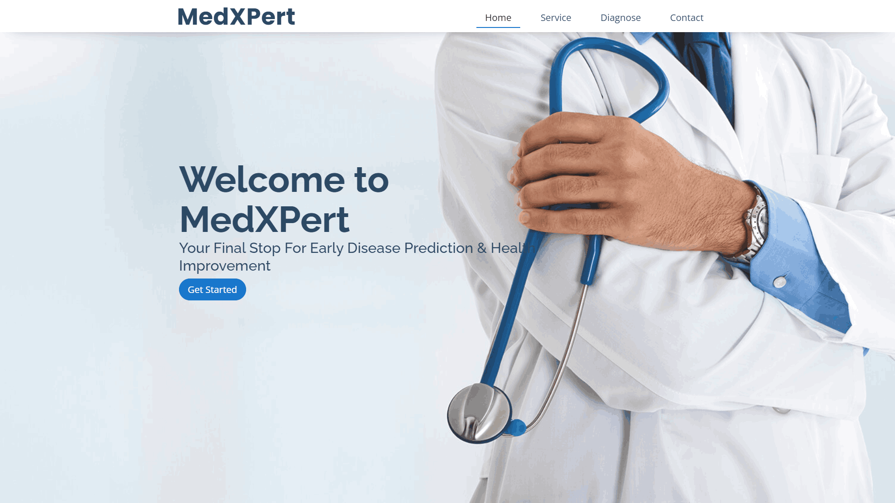
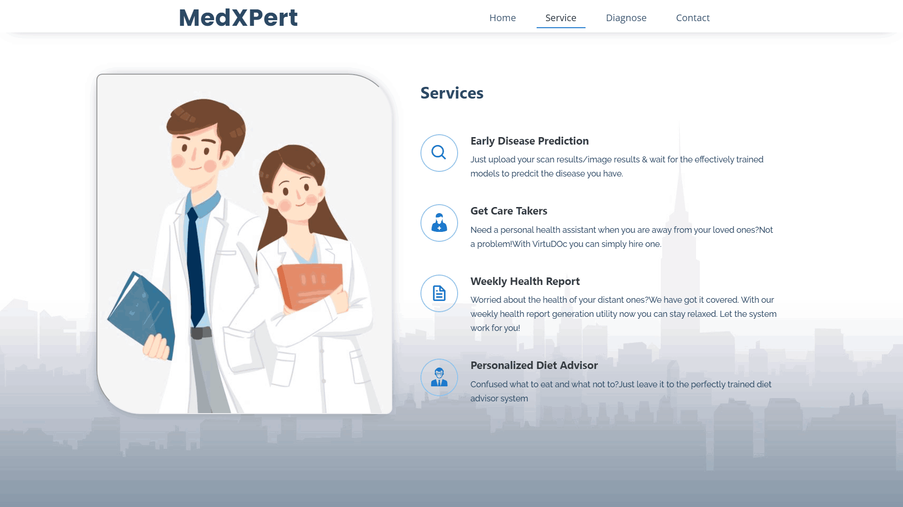
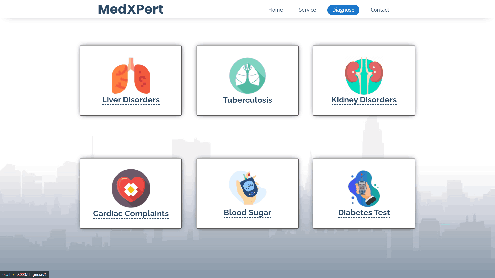
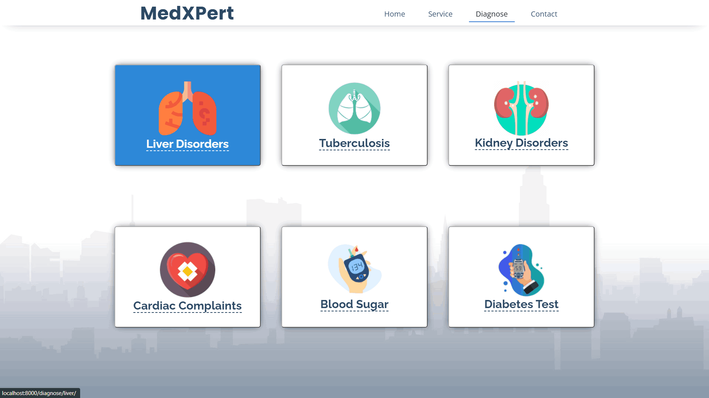
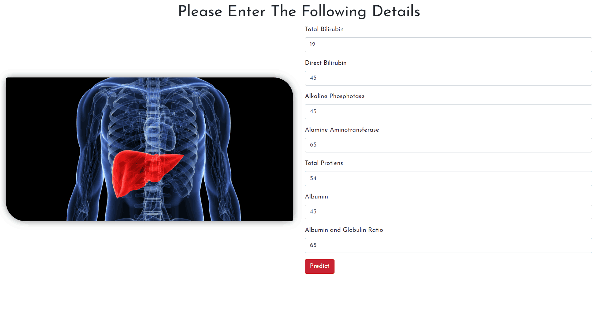

# <p align="center">Project Demonstration</p>

## Home



## Service


## Diagnose


## Liver Disorder


## Liver Disorder Checkup


## Risk Report


## Safe Report


<hr>

# <p align="center">Project Installations in Local System</p>

## Tools & Technology Required

- Python
- Django
- HTML
- CSS
- Javascript
- Machine Learning

<p align="center">


  
 
 


</p>

## Run Locally

- Download the Project and Unzip it
- Open Commant Prompt
> You must have Python3 installed in your system


Go to the project directory
```bash
    cd MEDXPERT_MAJORPROJECT
```

Create Virtual Envoirnment of Python
```bash
    pip install virtualenvwrapper-win
```

Make Virtual Envoirnment as I named it `venv`
```
    mkvirtualenv venv
```
Open Virtual Envoirnment as

```bash
    workon venv
```

Install Dependencies

```bash
    pip install -r requirenments.txt
```

Start the Server
```bash
    python manage.py runserver
```

>   Development Server started at `localhost:8000`

<hr>
<hr>

# <p align="center"> Development Documentations</p>

**Install Django in Virtual Envoirnment**

## Installation
Run this command to install `virtual wrapper` which will allows you to make virtual envoirnment
```
pip install virtualenvwrapper-win
```

Make Virtual Envoirnment as name `venv`
```
mkvirtualenv venv
```

Open the Command Prompt in Project Directory as
C:\Users\Ujjawal\Coding\Web Developement\MajorProject> `workon venv`

```
workon venv
```

Install `Django` in Virtual Envoirnment as
(venv) C:\Users\Ujjawal\Coding\Web Developement\MajorProject>pip install django
```
pip install django
```

Run this to Check `django-admin` Available Subcommands:
```
django-admin
```

Now, Create Django-Project by using django-admin subcommands
as `django-admin startproject` (projectName)
```
django-admin startproject project
```

Then Change you directory inside the folder name `project`
<hr>

## Setup files and folders
Now, create django app as `python manage.py startapp` (appName)
```
python manage.py startapp backend
```

Add this folder `backend` in `setting.py` file of our `project` file inside INSTALLED_APPS
```python
INSTALLED_APPS = [
    'django.contrib.admin',
    'django.contrib.auth',
    'django.contrib.contenttypes',
    'django.contrib.sessions',
    'django.contrib.messages',
    'django.contrib.staticfiles',
    'backend', # Added here
]
```

Now, Add Static files and urls in same file as (static file created by us to store all static webpage contents)
`import os`
```python
STATIC_URL = '/static/'
MEDIA_URL = '/images/'
STATICFILES_DIRS = [
    os.path.join(BASE_DIR,'static')
]
```

Now, open `urls.py` file of `project` folder

Add urls of `backend` file as

`import include` from `django.urls`
```python
urlpatterns = [
    path('admin/', admin.site.urls),
    path('',include('backend.urls')), # Added here
]
```
<hr>

### urls.py
Create `urls.py` file in `backend` folder
```python
from django.urls import path
from . import views
```

> path will be use to make `urlpatterns`
> importing `views` from the same directory so we use ( . )

Now, create `urlpatterns` from routing from one path to other as
```python
from django.urls import URLPattern, path
from . import views
urlpatterns = [
    path('', views.home, name ='home'),
]
```
`path('address', function defined on views , name)`

<hr>

### Templates
Create a folder name `templates` in `backend` directory
Inside this folder, we will store all `html` file/templates


#### index.html
create a sample index.html file to display with your django development server as
```html

<!DOCTYPE html>
<html lang="en">
<head>
    <meta charset="UTF-8">
    <meta http-equiv="X-UA-Compatible" content="IE=edge">
    <meta name="viewport" content="width=device-width, initial-scale=1.0">
    <title>Document</title>
    <link href="" rel="stylesheet">
</head>
<body>
    <h1>Hellow Duniya</h1>
</body>
</html>
```
<hr>

### Static
Create a folder name `static` in `backend` directory
Inside this folder, we will store all `css` `js` `img` and other files

#### css
Create folder as `css` in `static` directory and then create `style.css` file in `css` directory and write all css components there
and add this link in `head` tag of `index.html` as
```html
<link href="" rel="stylesheet">
```

>Must add `` on `html` file to include the external `static` directory

<hr>

### views.py
define function in your views as
```python
from django.shortcuts import render

def home(request):
    return render(request, 'templates/index.html')
```
`return render( request , return )`

> In this file, we will define our all function and backend logic to render it to the output screen


